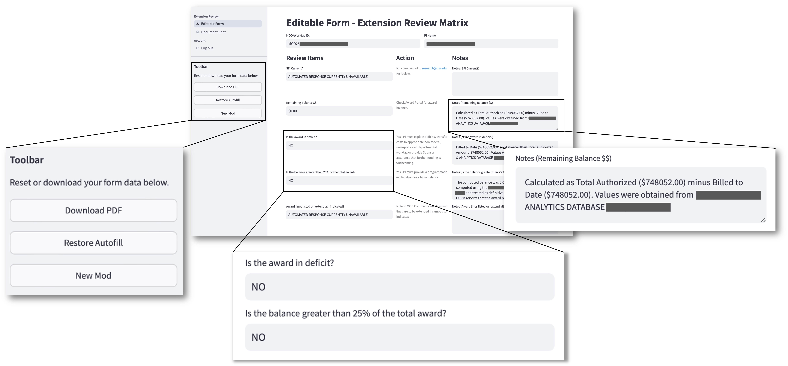
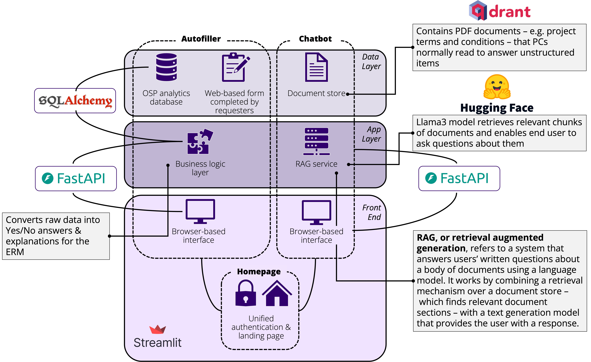
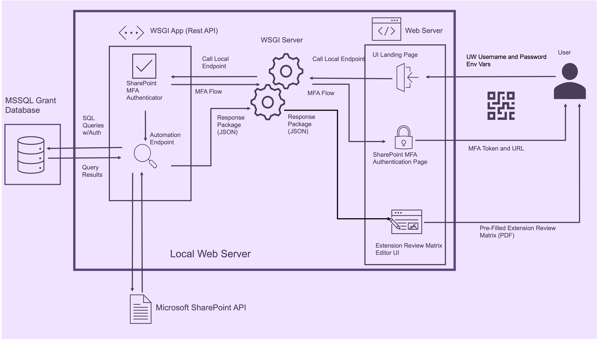
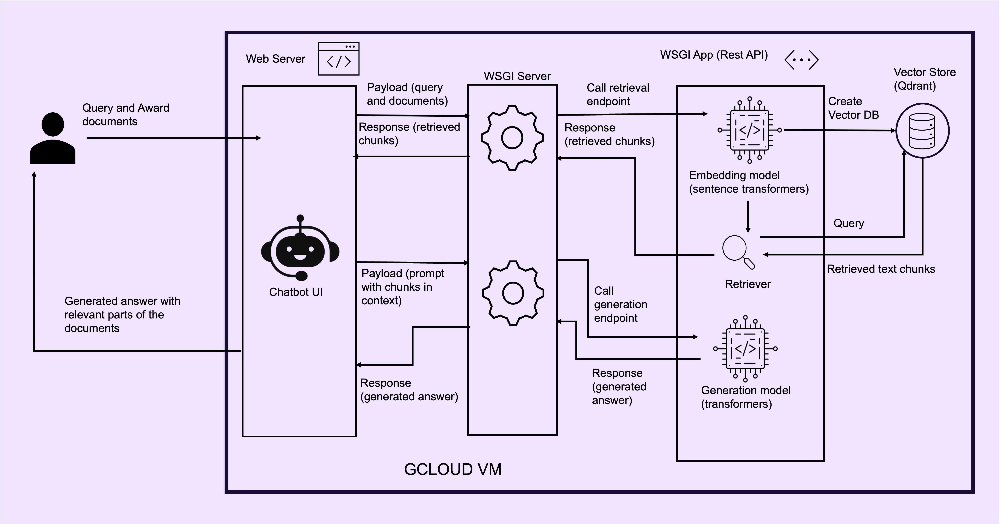

# UW GRACE: Grant Review Automation for Compliance Excellence

## Table of Contents

- [Context](#context)
- [Project Overview](#project-overview)
- [Getting Started](#getting-started)
  - [Launching the App](#launching-the-app)
  - [Navigating the Web Interface](#navigating-the-web-interface)
- [Developer Info](#developer-info)
  - [General Project Architecture](#general-project-architecture)
  - [Autofiller Architecture](#autofiller-architecture)
  - [Chatbot Assistant Architecture](#chatbot-assistant-architecture)
  - [Repo Structure](#repo-structure)
- [Next Steps](#next-steps)
- [ERM Shorthand Reference](#erm-shorthand-reference)
- [Acknowledgements](#acknowledgements)

## Context

The University of Washington's Office of Sponsored Programs (OSP) works with UW primary investigators (PIs) to manage grants, contracts, and other sources of funding for their research activites. Part of OSP's work is to process **no cost extensions (NCEs)** – requests by PIs to extend the length of a grant/contract without modifying funding commitments. NCEs may or may not be subject to approval by the sponsor of a grant. Program Coordinators (PCs) within OSP are responsible for reviewing PI requests for no cost extension and filling out a form called the **extension review matrix (ERM)**, which helps OSP decide whether sponsor approval is required.

## Project Overview

Our goal was to **establish a proof of concept for process automations to streamline PCs' NCE review workflow.** Before this project, PCs manually completed the Extension Review Matrix (ERM), looking up each review item individually. While some items required careful assessment, others were straightforward attributes that could be pulled directly from existing databases.

To design our solution, we thought of the ERM as containing two types of items:

- **Structured items** – objective attributes of a grant (e.g., budget details) that PCs previously had to look up and enter manually.
- **Unstructured items** – more complex elements requiring interpretation, such as reviewing contract terms to determine if sponsors explicitly require extension approval[^1].

To streamline the process, we aimed to:

1. **Automate structured items** by developing an autofill feature that pre-fills the ERM using university database records.
2. **Assist with unstructured items** by integrating a virtual assistant powered by a large language model (LLM), enabling PCs to quickly locate relevant document sections and ask content-related questions.

To ensure usability, we collaborated closely with a program coordinator in the Office of Sponsored Programs (OSP) and conducted user interviews with managers. These conversations helped us ensure that UW-GRACE uses relevant data, accurately replicates real-life workflows, and aligns the tool's outputs with the way PCs make decisions.

[^1]: Structured and unstructured review items are labels our team came up with to describe different items on the ERM. They are not inherent parts of the ERM structure.

## Getting Started

UW-GRACE is currently in the proof-of-concept phase. In this stage, we are only able to provide functionality to users affiliated with the University of Washington who have already been provisioned with permissions to access certain university IT resources. If you believe you fall into this category, please contact the contributors to this repository or [SSEC](https://escience.washington.edu/software-engineering/ssec/) to coordinate access. If you do not have the required permissions, you will not be able to run GRACE.

### Launching the App

Ultimately, GRACE is a proof of concept for a web app with an intuitive graphical user interface intended for OSP Program Coordinators. In the POC stage, users have to go through a few setup steps before being able to access the web UI.

To get started with UW-GRACE, you first need to install Docker.

On Mac OS, open the Terminal and run:
`brew install docker`

(Note: if you encounter errors running the commands below, you may also need to install [Docker Desktop](https://www.docker.com/products/docker-desktop/))

On Windows, please install Docker Desktop and enable wsl integration. See [here](https://www.docker.com/get-started/) for more info.

Once you've completed those steps, open the Terminal (Mac OS) or Command Prompt (Windows). Navigate to the folder where you'd like to store this project. [Clone this repository](https://docs.github.com/en/repositories/creating-and-managing-repositories/cloning-a-repository). Then, navigate to the top-level folder in this repo and run `./deploy/build.sh`

This will build containers that store the dependencies GRACE relies on and automatically and run the app. 

#### Credentials Wizard

The first time you run the GRACE app, you will be asked to enter a series of credentials in the terminal where you ran the previous command.

This step is essential to ensure you have permission to access to the relevant databases and to make requests to the backend system that powers the chatbot. Approved users/testers of the app will be provided with all of the information needed to complete the `credentials.sh` script. If you believe you are an approved user/tester but haven't been provided with credentials, contact the repo contributors or SSEC for assistance.

After you run `build.sh` and fill out your credentials, you should get a message that looks like:

```
frontend-1  |   You can now view your Streamlit app in your browser.
frontend-1  |
frontend-1  |   Local URL: http://localhost:8501
frontend-1  |   Network URL: http://172.18.0.3:8501
frontend-1  |   External URL: http://24.19.202.153:8501
```

Follow the Local URL (you should be able to Ctrl+Clickt the link) to open the app in the browser.

### Navigating the Web Interface

1. When GRACE launches, it needs to authenticate your access to UW Sharepoint. Click 'Proceed' and follow the instructions to authenticate. You will need to enable pop-ups and switch away from the tab where GRACE launched.


Once you confirm your UW NET ID, return to the tab where GRACE launched. Click 'Proceed'.

2. If authentication succeeded, you will see the following interface:


By default, users land in the `Editable Form` tab. This tab takes users through the autofiller. Users can also select the `Document Chat` tab, which leads to the chatbot. Steps 3-5 below show how to interact with the `Editable Form` interface; the remaining steps describe the chatbot.

3. Enter the MOD ID associated with the modification request for the no cost extension you'd like to process.


Click Proceed.

4. **The autofiller will run and return a partially completed ERM form:**


The Autofiller answers items that can be completed based on data in university systems, and 'shows its work' in the Notes section, indicating sources and how calculations were performed.

You can make changes to any section by selecting the text and overwriting it. Items that the Autofiller cannot address yet are marked with `AUTOMATED RESPONSE CURRENTLY UNAVAILABLE`. 

5. When you are done making modifications, click Download PDF. You will be able to continue working and making modifications to the PDF.

6. CONTINUE CHATBOT DOCS HERE

# Developer Info

## General Project Architecture



## Autofiller Architecture

At the highest level, the Autofiller portion of the GRACE application is organized as follows.



#### Data Layer

- Retrieves relevant data from the university’s databases using SQL queries.
- Uses SQLAlchemy to convert the database output into a Python-friendly format.
- Passes the processed data to the application layer as input.

#### Application Layer

- Processes data from the data layer, applies business logic, and generates responses for each question in the Extension Review Matrix (ERM).

#### Presentation Layer

- The user interface is a web application built with [Streamlit](https://docs.streamlit.io), a Python package that simplifies the creation of interactive web UIs.

## Chatbot Assistant Architecture

At the highest level, the Chatbot Assistant portion of the GRACE application is organized as follows.



#### Data Layer

- The `Retriever` class fetches relevant documents based on the user's query.
- This layer also manages the creation and retrieval of vector stores for efficient document retrieval.

#### Application Layer

- The `LanguageModel` class loads and utilizes language models for generating responses.
- Provides endpoints for document retrieval and response generation using FastAPI.
- Configures and runs the backend server using FastAPI to handle API requests.

#### Presentation Layer
- The chatbot frontend is integrated with the autofiller frontend, described above.

## Repo Structure

## `deploy`

The bash script `build.sh` in this folder installs software and libraries that the end user will need to run the GRACE Streamlit web app. The script:

- Installs the correct version of Python, if needed.
- Installs the poetry package manager, if needed, and uses it to load the right packages to run the web app.
- Allows the user to specify environment variables by calling a second `credentials.sh` script – please see below for details.
- Kills any processes running on the port needed to listen for API calls.
- Launches the Streamlit application.

This script represents a streamlined way to launch the web app without requiring end users to configure the computing environment.

The `credentials.sh` script configures a local `.env` file in the project root folder. This `.env` file is essential to run the app, since it contains login credentials to the relevant databases and allows users to connect to make requests to the chatbot API. Approved users/testers of the app will be provided with all of the information needed to complete the `credentials.sh` script. If you believe you are an approved user/tester but haven't been provided with credentials, contact the repo contributors or SSEC for assistance.

## `src/osp_nce` Folder Summary

This is the development folder. All code contributing to core app functionality (excluding tests) is here.

## `backend`

### Data Layer

- **`queries`**: Contains SQL query files for interacting with the database.
  - **`edw.sql`**: Contains SQL queries for retrieving data from the database.
  - **`nonprod_rad.sql`**: Contains SQL queries for retrieving data from the database.

- **`libs`**: Contains various utility classes for backend operations.
  - **`autofiller.py`**: Contains the `ERMAutoFiller` class for autofilling the Extension Review Matrix (ERM).
    - **Key Classes and Methods**:
      - `ERMAutoFiller`: An `AutoFiller` for the OSP Extension Review Matrix.
        - `__init__`: Initializes the `ERMAutoFiller` by querying/cleaning RAD and Extension Form data.
        - `autofill`: Main method to autofill the ERM.
        - `_process_extension_forms`: Processes the extension forms data.
  - **`sharepoint_connector.py`**: Contains the `SharepointConnector` class for interacting with SharePoint.
    - **Key Classes and Methods**:
      - `SharepointConnector`: Manages interactions with SharePoint.
        - `prompt_user`: Prompts the user for authentication.
        - `acquire_token`: Acquires an access token.
        - `get_item_info_from_short_link`: Retrieves item information from a short link.
        - `download_excel`: Downloads an Excel file from SharePoint.
        - `read_excel_from_short_link`: Reads an Excel file from a short link.
  - **`sql_connector.py`**: Contains the `SQLConnector` class for database interactions.
    - **Key Classes and Methods**:
      - `SQLConnector`: Manages SQL database connections and queries.
        - `query_from_string`: Executes a SQL query from a string.
        - `query_from_file`: Executes a SQL query from a file.

### Application Layer

- **`wsgi.py`**: Contains the FastAPI application setup and endpoint definitions.
  - **Key Classes and Methods**:
    - `Settings`: Configuration settings for the application.
    - `PingResponse`: Response model for the ping endpoint.
    - `AuthResponse`: Response model for authentication endpoints.
    - `AutofillRequest`: Request model for the autofill endpoint.
    - `AutofillResponse`: Response model for the autofill endpoint.
    - `startup_event`: Initializes data connectors for RAD and SharePoint on startup.
    - `shutdown_event`: Cleans up resources on shutdown.
    - `global_exception_handler`: Handles unhandled exceptions.
    - `ping`: Health check endpoint.
    - `prompt_azure_mfa`: Endpoint to prompt Azure MFA.
    - `acquire_access_token`: Endpoint to acquire an access token.
    - `autofill_erm`: Endpoint to autofill the ERM.

## `frontend` Folder Summary

### Presentation Layer

- **`app.py`**: Main entry point for the Streamlit frontend application.
  - **Key Functions**:
    - `request_device_flow_code`: Requests a device flow code for authentication.
    - `fetch_user_access_token`: Fetches the user's access token after authentication.
    - `display_login_page`: Displays the landing page for Microsoft device flow authentication.
    - `logout`: Clears session state and logs the user out.
    - `run`: Configures the app layout, defines page navigation, and renders the current page.

- **`chatbot_page.py`**: Contains the chatbot page implementation.
  - **Key Functions**:
    - `expand_query`: Expands the user's query (TODO: Update for grants).
    - `format_prompt`: Formats the prompt for the language model (TODO: Update for our use case).
    - `process_uploaded_files`: Reads uploaded PDF files and extracts text and metadata.
    - `retrieve_documents`: Retrieves relevant documents based on the user's query.
    - `generate_response`: Generates a response based on the formatted prompt.
    - `get_uploaded_documents`: Retrieves the list of uploaded documents.

- **`form_page.py`**: Contains the form page implementation.
- **`utils.py`**: Contains utility functions for the frontend.

## `llm_backend_vm`

### Dedicated LLM Environment

- **`.gitattributes`**: Configuration file for Git attributes.
- **`docker-compose.yml`**: Docker Compose configuration for the LLM backend.
- **`Dockerfile`**: Dockerfile for building the LLM backend.
- **`pixi.lock`**: Lock file for Pixi dependencies.
- **`pixi.toml`**: Configuration file for Pixi dependencies.
- **`devcontainer.json`**: Configuration file for setting up a development container.
  - **Key Configurations**:
    - Specifies Dockerfile and context for building the container.
    - Customizes VS Code extensions and settings.
    - Defines host requirements and container environment variables.
    - Specifies commands to run on container creation and post-creation.
    - Configures Docker and GPU access.

- **`Dockerfile`**: Dockerfile for building the development container.
  - **Key Steps**:
    - Installs basic apt packages and Pixi.
    - Installs Docker and configures NVIDIA runtime for GPU access.
    - Exposes necessary ports.

### `libs`

- **`models`**
  - **`embedding_model.py`**: Contains the `EmbeddingModel` class for handling embeddings.
  - **`language_model.py`**: Contains the `LanguageModel` class for loading and using language models.

- **`retriever`**
  - **`retriever.py`**: Contains the `Retriever` class for document retrieval.
    - **Key Methods**:
      - `create_vector_store`: Creates a vector store from documents.
      - `retrieve_docs`: Retrieves relevant documents based on a query.

### `serve`

- **`wsgi.py`**: Contains the FastAPI application setup and endpoint definitions.
  - **Key Endpoints**:
    - `/retrieve/`: Endpoint for retrieving documents.
    - `/generate/`: Endpoint for generating responses.

### `tests`

- **`test_generator.py`**: Contains tests for the response generation functionality.
- **`test_retrieval_api.py`**: Contains tests for the document retrieval API.
- **`test_retriever.py`**: Contains tests for the `Retriever` class.
  - **Key Tests**:
    - `test_retriever`: Tests the document loading and retrieval process.

## `shared`

Contains classes representing the Extension Review Matrix that are referenced by both the frontend and the backend.

### Forms

- **`forms.py`**: Contains form-related utilities.
  - **Key Classes and Methods**:
    - `FillableForm`: Base class for fillable forms.
      - `__init__`: Initializes the form with fields.
      - `update_fields`: Updates the form fields with new values.
      - `to_json_string`: Returns the internal form dictionary as a JSON string.
      - `get_concatenated_notes`: Concatenates field notes and returns them as a single formatted string.
    - `ExtensionReviewMatrix`: Subclass of `FillableForm` for the Extension Review Matrix.
      - `__init__`: Initializes the ERM with specific fields.
      - `update_fields`: Updates the ERM fields with new values.

### Templates

- **`extension_review_matrix_fillable_form.json`**: JSON template for the Extension Review Matrix (ERM).

## `eda`

This folder documents queries we performed to explore the datasets on which the GRACE web app depends, mostly the analytics database that the Autofiller queries. The purpose is to understand the data and ensure that the application layer correctly anticipates the format and conventions of data it ingests. Queries in this folder do not contribute to the function of the application.

## `tests`

### `test_autofiller.py`
- **Purpose**: Tests the `ERMAutoFiller` class.
- **Key Tests**:
  - Initialization
  - `autofill` method
  - `process_extension_forms` method
  - Review item methods (e.g., `ri2`, `ri3`, `ri8`, `ri9`)

### `test_forms.py`
- **Purpose**: Tests form-related utilities (`FillableForm` and `ExtensionReviewMatrix`).
- **Key Tests**:
  - Initialization
  - `update_fields` method

### `test_sharepoint_connector.py`
- **Purpose**: Tests the `SharepointConnector` class.
- **Key Tests**:
  - Initialization
  - Device flow methods (`prompt_user`, `acquire_token`)
  - Graph API methods (`get_item_info_from_short_link`)
  - File download (`download_excel`)
  - Excel read (`read_excel_from_short_link`)

### `test_sql_connector.py`
- **Purpose**: Tests the `SQLConnector` class.
- **Key Tests**:
  - Initialization
  - Query execution (`query_from_string`, `query_from_file`)
  - Parameterized queries

## Next Steps

This is an ongoing project. To see the roadmap for continued development, please see the [Milestones](https://github.com/uw-ssec/osp-nce/milestones) section of this project.

## [Reference]: ERM Shorthand

Throughout our codebase, we refer to items that appear on the extension review matrix (ERM). These are verbose, so we usually abbreviate them. The table below specifies abbreviations.

`ri` stands for "Review Item". Review items are enumerated in the order they appear on the ERM. The review items below are from the Spring 2025 version of the ERM; this may be updated in the future.

| Code Abbreviation | Form Text                                                                    |
| ----------------- | ---------------------------------------------------------------------------- |
| `mod-worktag-id`  | Mod/Worktag ID:                                                              |
| `pi_name`         | PI Name                                                                      |
| `ri1`             | SFI Current?                                                                 |
| `ri2`             | Remaining Balance $$:                                                        |
| `ri3`             | Is the award in deficit?                                                     |
| `ri4`             | Is the balance greater than 25% of the total award?                          |
| `ri5`             | Award lines listed or "extend all" indicated?                                |
| `ri6`             | Temporary request?                                                           |
| `ri7`             | New cost share?                                                              |
| `ri8`             | Human Subjects?                                                              |
| `ri9`             | Animal Use?                                                                  |
| `ri10`            | Prior approval required?                                                     |
| `ri11`            | Has the project previously been extended? Is this an NIH 2nd+ extension?     |
| `ri12`            | Is the request to extend within Sponsor's required timeframe?                |
| `ri13`            | Is this a federal contract?                                                  |
| `ri14`            | For federal contracts only: is FAR clause 52.222-54 incorporated (e-verify)? |
| `ri15`            | Fixed Price terms?                                                           |
| `ri16`            | Paid in full?                                                                |
| `ri17`            | All deliverables submitted?                                                  |
| `review_notes`    | Review Notes                                                                 |

## Ackowledgements

We warmly thank Vani M. (SSEC), Carol R. (OSP) , Aron Suzanne K. (Office of Research), Diego B. (ORIS), and Damanjot K. (OSP) for their partnership & support as sponsors.