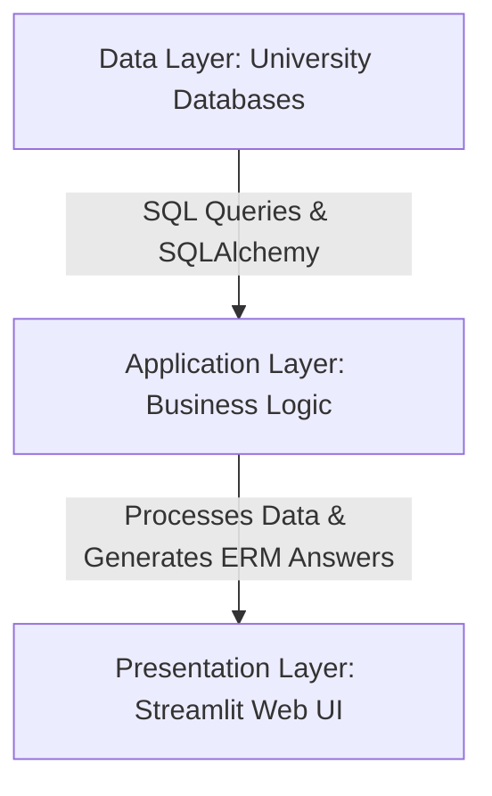

# `src`

This is the main development folder.

## Application Architecture

### Data Layer
- Retrieves relevant data from the university’s databases using SQL queries.
- Uses SQLAlchemy to convert the database output into a Python-friendly format.
- Passes the processed data to the application layer as input.
### Application Layer
- Processes data from the data layer, applies business logic, and generates responses for each question in the Extension Review Matrix (ERM).
### Presentation Layer
- The user interface is a web application built with Streamlit, a Python package that simplifies the creation of interactive web UIs.
- While the frontend is ultimately rendered in HTML and JavaScript, we do not develop it directly in these languages.


```
+---------------------------+
|  Presentation Layer       |
|  (Streamlit Web UI)       |
+---------------------------+
            │  
            ▼  
+---------------------------+
|  Application Layer        |
|  (Business Logic)         |
|  - Processes data         |
|  - Generates ERM answers |
+---------------------------+
            │  
            ▼  
+---------------------------+
|  Data Layer               |
|  (University Databases)   |
|  - SQL Queries            |
|  - SQLAlchemy for ORM     |
+---------------------------+
```




